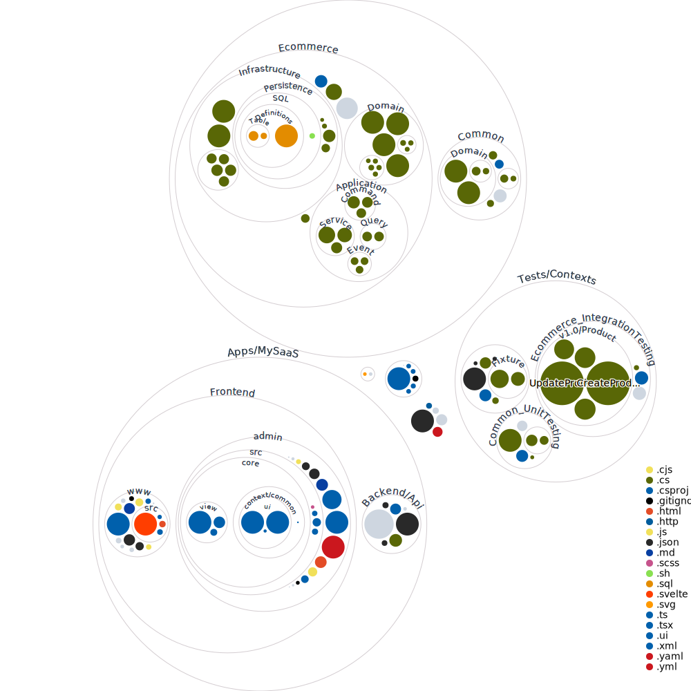
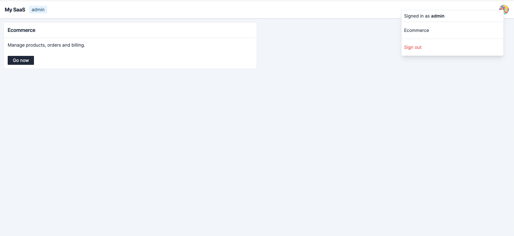

# dotnet

- .NET 7
- Dapper
- Postgres 15

> Docker and k6 are required for development and testing purposes



### Dashboard



### Scripts

```make
check:
	dotnet clean
	dotnet restore
	dotnet build
	dotnet test

infra-start:
	docker-compose up

infra-down:
	docker-compose down

webapi-watch:
	dotnet watch --project ./Apps/MySaaS/Backend/Api/Api.csproj

webapi-start:
	dotnet run --configuration Release --project ./Apps/MySaaS/Backend/Api/Api.csproj
```