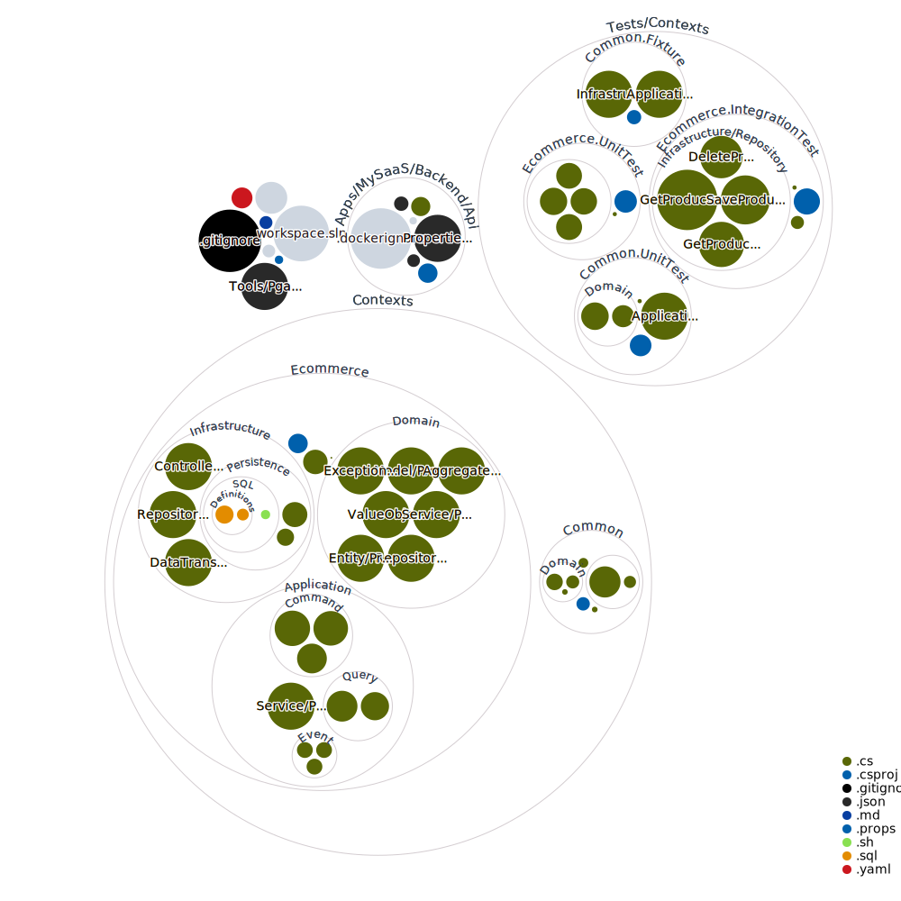

# dotnet workspace

- .NET 7
- Dapper
- Postgres 15

> Docker is required for development and testing purposes



## Start infra

```bash
make infra-dev
```

## Start webapi

```bash
make webapi-dev
```

## Test
```bash
make test-unit
make test-integration
```